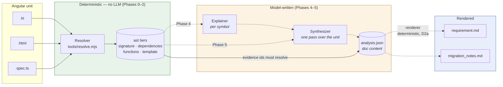
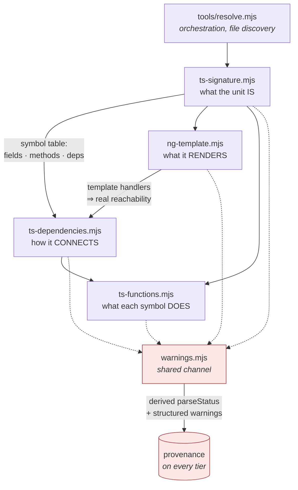
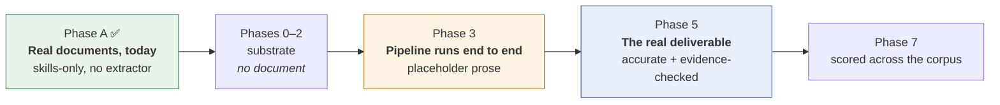
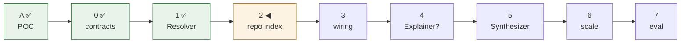

# Architecture

How the pieces fit, what each file is responsible for, and when a full document appears.
Intent lives in `plans/0_ProjectDescription.md`; the reasoning behind each choice in
`plans/1_Decisions.md`.

**Legend for every diagram below:** solid = built and running; dashed = planned, with its phase.

## 1. The pipeline

One Angular unit goes in. A human-reviewable specification comes out. The left half is
deterministic and contains no model output; the right half is written by an LLM and must cite
the left half as evidence.

The one arrow worth staring at is the bottom one. Every claim in `analysis.json` carries
`evidence` ids pointing back into the `ast` tiers, and a dangling id is a hard failure. That is
what stops the model half inventing behavior the code does not have.

## 2. Dataflow inside the Resolver

The four extractors are not independent — each later one needs the earlier one's symbol table to
know what `this.x` *is*. `this.foo.bar()` means three different things depending on whether `foo`
is a field, a method, or an injected dependency, and nothing in the syntax says which.

`template → dependencies` is the edge that matters most: without it, a method called only from a
template binding looks uncalled, so `unreachableMethods` over-reports. When no template is
parsed the tier says so via an `upper-bound-only` warning rather than presenting the list as
fact.

## 3. What each file is responsible for

### Extraction — `tools/`

| File | Owns | Notes |
|---|---|---|
| `resolve.mjs` | Orchestration: find the unit's files, run the four extractors in order, write the tiers | Never throws on bad input — records and continues to the next file |
| `resolve/ts-signature.mjs` | `signature.json` — class, public API, DI, lifecycle, state outline | Runs first; everything downstream needs its symbol table |
| `resolve/ts-dependencies.mjs` | `dependencies.json` — call graph, field access, HTTP, routing, imports | Emits reverse indexes (`calledBy`, `readBy`) alongside forward ones |
| `resolve/ng-template.mjs` | `template.json` — control flow, bindings, events, a11y, i18n | Parses with the **analysed repo's** `@angular/compiler`, not ours, since template syntax is version-sensitive |
| `resolve/ts-functions.mjs` | `functions.json` — per-symbol detail, forms, signals, streams, spec cases | Emits `ast` only; the `doc` half belongs to the Explainer |
| `resolve/warnings.mjs` | The warning channel and `parseStatus` | Closed code vocabulary; an unlisted code throws |

### Verification — `tools/`

| File | Answers | Why it cannot be replaced by the others |
|---|---|---|
| `validate.mjs` | "Is each file well-formed against its schema?" | Reads one file at a time |
| `check-integrity.mjs` | "Does every id referenced in one tier exist in the tier that owns it?" | A dangling id is perfectly well-formed on its own |
| `golden.mjs` | "Did behavior change unnoticed?" plus pair equivalence | Goldens are written from the extractor's own output, so they prove *stability*, never *correctness* — the pairs and `mustExtract` assertions carry that |
| `query.mjs` | "What calls `save()`?" without loading 16 KB to get a 4-byte answer | Context budget is the cost being managed |

### Contracts and inputs

| Path | Role |
|---|---|
| `templates/schema/*.schema.json` | Sole authority per tier: shape, field semantics, tier purpose, id conventions. Validation is enforcement, not documentation |
| `templates/requirement.md`, `migration_notes.md` | The two render targets |
| `fixtures/` | Hand-written Angular, one construct each — what extractor tests run against. Its `expected.*.json` goldens double as the worked example of every tier: real, schema-validated output rather than placeholders |
| `fixtures/fixtures.json` | What each fixture *must* extract. Written before the extractor, which makes it a specification |
| `angular-docs/` | Pinned 17.3.9 typings + guides, gitignored. Authoritative when prose and typings disagree |
| `INPUT/` | Held-out evaluation corpus — deliberately not consulted during design |

## 4. When do I see a full end-to-end document?

Three different answers, because "end to end" means three different things here.

| When | What you can read | Trust it for |
|---|---|---|
| **Now** | `examples/baseline_skillsonly/` — two complete `requirement.md` + `migration_notes.md`, produced by `/code2docs-analyze` with no tooling | Judging whether the *document shape* is useful. This is exactly what Phase A existed to answer, and F1/F5 say yes |
| **Now, on any component** | Run `/code2docs-analyze INPUT/<path>` | Same — real prose, unverified recall |
| **Phase 3** | First document assembled *by the pipeline*: five tiers → rendered markdown | Proving the wiring works. Prose is deliberately placeholder-quality |
| **Phase 5** | The real thing: accurate prose, every evidence id resolving, human edits preserved across re-runs | Actual review |

So: **you can read a full document today** — the skills-only path already produces one, and two are committed. What Phases 0–2 buy is not a *new* document but a *trustworthy* one; F2 (domain terms drifting from real identifiers) and the omission risk are what the deterministic substrate exists to fix.

The honest caveat: Phase A's documents were reviewed for accuracy, not for completeness against
the whole corpus, and both of their *blocking* open questions need repo-wide information that
only Phase 2 produces (F3).

## 5. Current position

Phase 1 is complete: four extractors, a structured warning channel with a derived `parseStatus`,
the D3a recall audit, and the exit measurement recorded in `benchmarks/phase1-omission.json`
(F16). What it does not cover is cross-unit — HTTP routed through injected services, `consumedBy`,
selector resolution — which is Phase 2's job and is flagged in the output rather than left silent.

Phase 4 carries a question mark because **D8** requires proving the Explainer earns its place
before building it. F14's `analysis.json` shape work should land before that phase either way.
